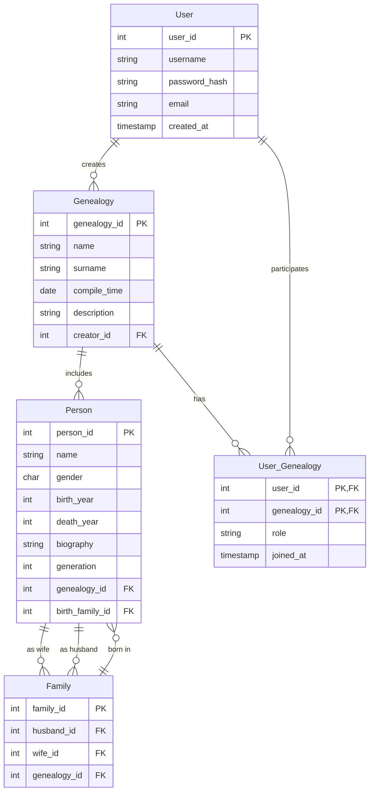

```mermaid

erDiagram
    User {
        int user_id PK
        string username
        string password_hash
        string email
        timestamp created_at
    }

    Genealogy {
        int genealogy_id PK
        string name
        string surname
        date compile_time
        string description
        int creator_id FK
    }

    Person {
        int person_id PK
        string name
        char gender
        int birth_year
        int death_year
        string biography
        int generation
        int genealogy_id FK
        int birth_family_id FK
    }

    Family {
        int family_id PK
        int husband_id FK
        int wife_id FK
        int genealogy_id FK
    }

    User_Genealogy {
        int user_id PK,FK
        int genealogy_id PK,FK
        string role
        timestamp joined_at
    }

    User ||--o{ Genealogy : creates
    User ||--o{ User_Genealogy : participates
    Genealogy ||--o{ User_Genealogy : has
    Genealogy ||--o{ Person : includes
    Person }o--|| Family : "born in"
    Person ||--o{ Family : "as husband"
    Person ||--o{ Family : "as wife"

```